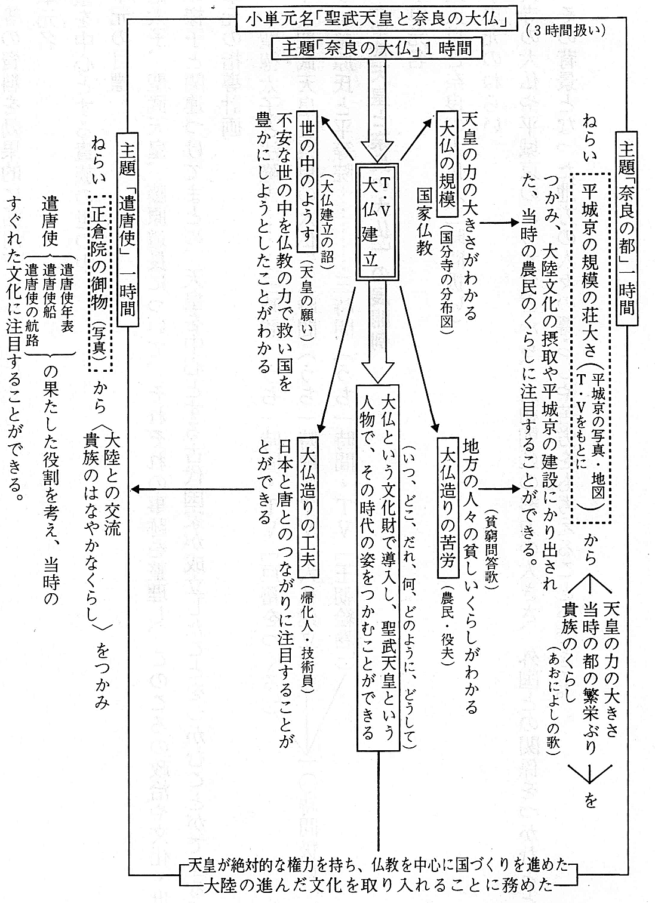
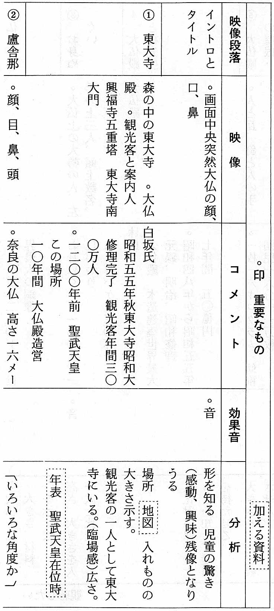

# 第１章 時代のイメージをとらえるための授業分析⸺『くらしの歴史』を活用して⸺

## １ 歴史的内容の学習にテレビ番組を利用する意義

社会科の基本的なねらいは、小学校学習指導要領・社会の第一目標に示されている。すなわち、「社会生活についての基礎的理解を図り 、………… 民主的・平和的な国家・社会の形成者として必要な公民的資質の基礎を養う」ことが示されている。

公民的資質の基礎を育てるには、なんといっても、児童の正しい社会認識が大事である。社会認識には、いろいろな角度からの多様な分析や解釈が必要になろうが、この一つの側面として、歴史的内容の学習を通して、歴史的な見方・考え方の基礎を育てることがある。このことを学習指導要領では、「歴史に対する理解と愛情を育て」と示している。それでは、歴史に対する理解と愛情を育てる歴史的な見方・考え方の基礎とは、児童のうえに、具体的にどのような形で表れるものなのか。

第六学年では、時代を象徴する文化遺産に人物をセットして、「その人物が生き、または、影響を与えた時代の姿を、五年生までに育てられた歴史的な見方・考え方を活用しながら、一人ひとりの児童が、それぞれに、自分なりのイメージを持つ」ということであろう。

児童がとらえた時代のイメージは、文化遺産や人物を見る角度によって違うであろうが、何といっても、まず、一人ひとりの児童が、時代のイメージを持つことが大切である。極端に誤まった見方は認められないかも知れないが、さまざまな角度から異なる感情・感覚で見て、自分なりに、他人と違った時代のイメージを構築することこそ大事である。さらに、一人ひとりの児童が、自分なりに構築した時代のイメージは、学習集団の中で、多様な形で発表され、それについては、できるだけ多く、学習者相互で考察され、それを手がかりに、一人ひとりが、修正し、ふくらまして、より豊かなイメージをつくり、社会認識（ここでは歴史認識）を確かなものにすることを期待しているのは当然のことである。

ところで、誤まりの少ない、より確かな時代のイメージを構築するとはいっても、歴史的学習の対象となるものは、すべて内容が過去のものであり、児童が直接経験したものではない。そこで、その歴史が展開されていた時代はどんな姿だったのかを描かせるといっても、それをイメージ化することは大変難しいことである。そこで、なるべく、それに近い事実的経験を感情的知覚に訴えてつくり出してやり、歴史が展開されていたその時代に児童を導き、そして、立たせる必要がある。それには、文化遺産や人物等の歴史的素材を通して、時代に対する親近感を呼び起こすとともに、関心を培い、その時代へ児童を自然に案内してやり、文化財に触れさせ、それを造った（造らせた）歴史上の人物との遅垢を図り、その働きを通して時代の姿がとらえられるようにしたいのである。

そのためには、発掘された文化財に人物を添えての取り上げ方が大事になる。その取り上げ方は、いろいろあろうが、児童を居ながらにして、知らず知らずのうちに、歴史的世界へ案内し、時代の入口に立たせ、時代を具体的な姿としてとらえさせる最も有効なメディアとして、テレビ番組（映像）がある。小学校六年生の番組『くらしの歴史』は、学習指導要領をふまえながら、児童を歴史が展開されていた時代へ導くように構成されている。したがって、児童は、テレビの映像を通して、時代へ接近し、時代のイメージをつくる手がかりが得られ、さらには、その時代の主人公なり、あるいは、その時代の一人になれるのである。時代の主人公、あるいは、時代の一人になれるということは、その時代の人の身になってものを具体的に見、かつ、考えていくことであり、それは歴史に対する理解と愛情を持つということになる。

## ２ 放送を用いた単元の計画

『くらしの歴史』を利用する趣旨は、前述したように、時代のイメージを培い、その単元のねらいを達成する手だてであり、社会科のねらいを具現するためである。そのためには、社会科のねらいや、各学年・各単元のねらいや重点、留意事項が、教師に総合的に明確におさえられていなければならない。つまり、社会科のねらいからしても、放送のねらいからしても、無理のない効果の上がるような指導計画の作成が必要となる。

### （１） 社会科の年間指導計画の作成

指導計画の作成にあたっては、学年初め、学習指導要領で示された内容11、内容２のアからオに関する教科書の内容を分析・検討し、（図IIIー１を参照）それぞれの時代での学習の中核となる基本的内容を精選し、これをもとに学習内容の構成を図る。つまり、何を中核におけばその時代の姿をつかめるか。また、そのためには、どのような学習素材（文化遺産や人物等）を配慮すればよいかについて明確にする。

小単元の細案の作成にあたって、特に、大事なことは、その時間におけるねらいの具体化、明確化ということである。本時のねらいを具体的にはっきり書くことによって、指導のねらいや、視聴のねらいがおさえられるからである。さらに、本時の学習を集約するような主題をつけて、児童に本時の学習が、浮き彫りできるように工夫すればより効果的であろう。さらに、小単元のうち、どの時間配列に放送が位置づいているかを明確にすることである。そうすることによって、放送を用いた意図もはっきりしてくるからである。このような営みは、教師の教科をみる目の育成につながり、実践授業へのエネルギーにもつながるのである。以上のようなことをふまえ『くらしの歴史』を導入して作成した小単元計画の一例を示す。（表Ⅲ-1）

### （２） 単元の計画

#### ◯教科目標

社会生活についての基礎的理解を図り、我が国の国土と歴史に対する理解と愛情を育て、民主的、平和的な国家・社会の形成者として必要な公民的資質の基礎を養う。

#### ◯学年目標

① 国家・社会の発展に貢献した先人の業績や優れた文化遺産についての関心と理解を深め、我が国の歴史や伝統を大切にしようとする態度を育てる。

② 現在の国民生活の安定および向上にとって重要な政治の働きを理解させるとともに、我が国が国家社会の中で占めている役割に気付き、世界の中の日本人としての自覚をもつようにさせる。

③ 我が国の歴史や国民生活に関する基礎的資料を効果的に活用させる。

#### ◯大単元名

日本の歴史

#### ◯大単元目標

① 国家・社会の発展に貢献した人物の働きや代表的な文化遺産を中心として、我が国の歴史の主な事象について理解させるとともに、我が国の歴史や伝統に対する関心を深めさせる。

② 人物や文化遺産を手がかりとして、主な歴史事象をとらえたり、年表・史料・地図・グラフ・テレビ等の資料を効果的に活用できるようにする。

#### ○単元名

天皇を中心とする貴族の世の中

#### ○単元の目標

聖徳太子、聖武天皇、藤原道長について、それぞれの事跡を整理し、このころの政治や文化・世の中の様子と関連づけてまとめ、天皇を中心とする古代国家が成立したことをつかむことができる。

#### ○単元の指導計画

ア 聖徳太子と法隆寺 …………. 三時間（うち一時間・TV「戸籍をつくる」）

イ 聖武天皇と奈良の大仏 ..三時間（うち一時間・TV「大仏建立」〉

ウ 藤原氏と平等院 ………………. 三時間（うち一時間・TV「王朝絵巻」）

以上を計一〇時間扱いとする

### （３）「聖武天皇と奈良の大仏」の展開例

#### ○小単元名

聖武天皇と奈良の大仏（三時間扱い）

#### ○小単元のねらい

東大寺の大仏や平城京のようすなどから、大和朝廷の勢力の大きさ、外国との関係をつかむとともに、その背景となった地方の人々の暮らしや苦労をも考えることができる。

## ３ 番組内容の分析

### （１）『くらしの歴史』シリーズの特徴と構造

『くらしの歴史』は、「小学校学習指導要領・社会」を基準として、六年生が、歴史的な学習をしていくうえで、教室でつかみとりにくい、しかも、その単元の中で、重要であると思われる側面に焦点を当て、テレビの特性を生かしながら、学習を豊かにすることをねらっている。したがって、それぞれの番組内容は、単元の概説や要約ではなく、日本の歴史の時代相や、どこの時代に、どんな生活が営まれ、どんな文化が起こり、また受け継がれたのか。そして、それが現代に生きるわたしたちの生活とどう結びついているか、などなどをより深く知るための手がかりとなるように考えられている。

毎回のテーマについては、単なる知識としてではなく、児童が共感・感動をもって受け止めてくれるように、ドラマ、フィルム構成など、中心テーマを浮きだたせるのにふさわしい演出方法を取り入れ、構成されている。（「学校放送テキスト」より）

この番組は、時代考証の行き届いたドラマを中核として映像のもつ躍動的な力を活かし、努めて過去をありのままに再現しようとする。このような内容によって、時代へ接近し、その時代を目のあたりに見る思いがする。番組に登場する人物は、自分たちとあまりかけはなれた人物ではなく、歴史上の人物とつきあえるという感じをもたせるように配慮されているし、重要な歴史的事実や史料はできるだけ取り上げ、科学的な学習ができるように考えられている。

### （２） 番組「大仏建立」の特徴と構造時代のイメージを培うための放送の特徴と構造とを、五月二四日放送の「大仏建立」で具体的に見てみよう。

#### ① 学校放送テキストによる〔ねらい〕と〔内容〕

***〔ねらい〕*** 東大寺の大仏建立を中心に、奈良時代の社会の様子、大陸文化の摂取、国家仏教の意味などを考える。

***〔内容〕*** 大化改新以来、法典を編さんし、諸制度を整備し、国力の充実につとめてきた律令国家の象徴としては、平城京に見られる壮大な都づくり、正倉院御物にみられる世界的文化、それに東大寺に示される国家仏教などがあげられる。ことに東大寺の大仏は、高さ一六メートル、重さおよそ二五〇トンと推定され、銅像としては世界最大のものであり、大仏殿も最大の木造建築物である。天平時代、聖武天皇は、国の富を傾けてこの大仏を造ろうとした。

番組では、以上の観点から、この巨大な大仏はなぜ、何のために造られたのだろうか、どのような技法が用いられたのだろうか、という問題を考えていく。ことに、大仏のような巨大な銅像は、アジア各地の巨大な石造仏の系譜をひくにしても、その鋳造はどのような技法によって行われたものであろうか。この点については、アニメーション・フィルムを作成して謎ときをしていく。こうしたことを通して、大陸文化の摂取や当時の人々の独創力などについても考えていきたい。

#### ② 「大仏建立」内容の分析

#### ③ 番組「大仏建立」の内容の考察

ア、東大寺の大仏の形・大きさ・造り方の概要をわかりやすく解説し、よくまとめている。

イ、現地に出かけて、大仏、大仏殿、平城京などの実際を見ることは、ほとんど不可能だから、これが、今望み得る最良の教材である。

ウ、たとえ現地に出かけたとしても、「お身ぬぐい」や「大仏殿の瓦・釘」などを通しての大仏の大きさや、建立の様子などは見ることができない。テレビ映像は、現場学習を超える部分もある。

ェ、大仏の各部分をいろいろな角度からカメラの目でとらえて見せてくれるので、見たいところが比較的よく見取れる。

オ、大仏の鋳造技法について、アニメーション・フィルムで、謎解きをしたが、それがすばらしく、心憎いばかりである。

カ、児童を奈良（平城京）に導き、そして、立たせるには、もっと奈良（平城京）の映像に時間をかけなくてはなるまい。

キ、聖武天皇の業績を通して、その時代を歴史のエポックとして認識させるには、解説者の林先生が立って、社会の様子、国家仏教についての解説を多くしただけでは意味があるまい。聖武天皇在位時の年表、国分寺の映像や分布図などを差し込んでみてはどうだろうか。

ク、大仏殿の修理に費やされた五〇億円とか、瓦一一万枚とかいうコメントだけでは、具体的に大きさをとらえさせることはできない。

いろいろな角度からの注文をつけたが、児童の頭の中に、残像として何を印象づけたいのか、それには、どんな映像を選び、どんなコメントを添えれば、それが可能となるのか、十分考慮されなければなるまい。

## ４ 授業分析の視点と方法

### (１) 授業のねらいと分析のねらい

授業分析にあたっては、形態上、構造上、技術上、いろいろな方法があろうが、ここではそのような枠にとらわれることなく、テレビを導入して、時代の姿を生き生きとより確かにとらえさせるための授業、それには、どんな配慮が必要なのだろうかという角度から分析してみることにする。そのためには、まず、本時のねらいの確かさ、教材（映像）の出し方とその質、児童の映像のとらえ方とその変化（意味場の構成）を授業分析の視点とする。そして、流れと速さと広がりのある授業の構成のための放送の役割を明確にしてみたい。

#### ① 本時のねらいの確かさ

社会科には、社会科としてのねらいから学年のねらい、大単元・小単元のねらい、さらには、一時間の授業のねらいまで、そこには縦に一貫して流れている主張があるはずである。だから、いかに一時間の授業のねらいを吟味しても、それを支えている大きな意味がわからなくては、小手先の授業にとどまって、いわば、断片的な知識の授業になってしまう。そこで、一時間の授業のねらいが、ひとつひとつ構造的なつながりを持つような指導をする必要がある。

もうひとつは、本時のねらいの具体化である。この具体化とは、児童の立場から見たときに、よくわかること、はっきりすることである。授業の中で、児童がどんなことをとらえたらよいのか、どのようにとらえたらよいのかということを明確にすることである。

#### ② 教材（映像）の出し方とその質

どんな授業にしても、児童の状態をおさえたうえで、明確なねらいが設定され、そのねらいに対して教材が選択されなければならない。さらに、そのねらいを達成するためには、選択された教材が構造的に配列され、児童に提示されなければならないし、授業を効率化し、「流れ」と「速さ」と「ひろがり」のある授業をするためには、教材（映像）の質の吟味も必要となる。

#### ③ 児童の映像のとらえ方とその変化（意味場の構成）

児童の映像のとらえ方は、表現内容によってある程度つかむことができる。それは、多分に、主観的であり、感覚的であり、点的であるところに特色がある。そこで、視聴後の指導では、断片的な把握をもっと何とかつなぎ合わせて客観的なものにし、正しい認識にまで発展させる必要がある。そのためには、授業分析の中で、児童の発言を大事にし、その発言をもとにして、さらに、発展的な発言を期待しながら、教師の発問に工夫を凝らし、児童がどのようなとらえ方をしているときに、映像のどこに戻らせ、どんな教材をどのように提示し、どのように考えさせたらどう変化していくのか、その変化していく過程が授業の中で吟味されなければならない。児童の自由を真に生かすというのは、こうした指導であろう。

### (２) 主題「奈良の大仏」の指導と分析

#### ① 本時の学習のねらい

ア、テレビ教材「大仏建立」の視聴を通して。

・大仏の大きさやその造り方が具体的にわかり、それをもとに天皇の力の大きさ・天皇が当時の不安な世の中を仏教の力で豊かにしようとしたことＹをまとめることができる。

イ、具体的な事実に着目して、事実を想い浮べながら考え、イメージを創り、集団の中で自分の考えやイメージを深め、豊かにすることができる。

#### ② 本時に放送を用いた意図

東大寺に児童を案内し、大仏の大きさ、大仏造り、平城京などの具体的な姿を印象づけるには、「大仏建立」を中心に展開してくれるテレビ教材が最適であろう。それによって受けた児童のイメージを大事にしながら、天皇の権力や国家鎮護の仏教ということにまで考えを進めさせたい。

#### ③ 視聴直前（約一分間）

年表（七〇〇年から八〇〇年までのもの）は正面に掲示。地図（日本全図）は斜右前面に掲示。児童は自作の白年表を机上に置く。

課題づくりまでの児童の発言内容から考えられることを分析してみよう。。大仏と大仏殿の大きさをとらえさせるのに、あるものとの比較という形で提示された、映像M2、21、22、23、24は、児童に分りやすかった。

◯大仏の様子に注目した児童は、イントロの部分で、突然、暗い何も映っていない画面中央に現れた大仏の顔が残像として後まで影響していたのかも知れない。また、大仏の座り方、手の位置、顔、目、鼻、口、頭と見たいと思う部分をカメラの目で見せてくれたので、実物に近い見方ができたと思われる。

○イントロの東大寺を中心とした映像M1、２、３は、児童に臨場感を持たせるのに効果的であった。

○コメントについては、大きさに関する数詞に注目しているものが多かった。

○コメントはナレーターと解説者と二人で行っているが、ナレーターのほうに注目しているものが多かった。解説のほうは取って付けたという感じがした。

◯大仏の造り方については、アニメーション・フィルム（映像M5〜19）でイメージ・アップできたと思われる。また、効果音も優れていたと考える。○発言した児童は、放送された内容のこまかい事実に注目している。

◯テレビ映像は事実認識を確かなものにし、流れと速さのある効率的な授業の構成に力があると思われる。流れとは、活動性、連続性、方向性が組織されていることである。速さとは、一連のつながりをもちながら、時には密な授業から加速とか飛躍を作ることである。流れに関する児童の発言は、（③⑦(10)(11)(12)であり、速さに関する児童の発言は、⑧(13)(14)(15)(16)と考える。

学習の深化の契機となる課題が提示された後の学習について、児童の思考過程を中心に、テレビ内容とのかかわりを分析してみよう。詳しく示した授業過程から、容易に抽出できることは次のとおりである。

◯テレビ映像を通して、事実認識が深まっていたので、児童の思考・判断を多様に引き出すことができた。

◯映像の中の大仏の大きさが、脳裏に鮮明に焼き付いているので、ほとんどの児童が、「大きい」という表現を用いている。

◯天皇権力ということについては、「大仏の大きさ」と「国分寺」、さらには資料とで総合的にとらえて解釈している。

◯庶民の立場で時代のイメージを構築している児童の大部分は、「大仏の大きさ」については注目せず、コメントに注目しているように思われる。

◯実際には、見ることのできない天平時代の様子をできるだけ史実を浮き上がらせようと、大仏の姿をカメラの目があらゆる角度からとらえて見せ、大仏造りをアニメーション・フィルムで実感させてくれたので、いろいろな事実を具体的に、想像的に考え出し、聖武天皇や庶民になり、立場を変えての討議によって、聖武天皇在位時の奈良権力や国家鎮護仏教にまで学習を発展させることができた。

◯個々ばらばらな児童の既有経験を共通な意識にまで高めるために、事例からもわかるように、児童にとって、矛盾や好奇心や共鳴を合わせ持った驚きのある歴史的事実を選び出し、テレビ内容を構成することが望まれる。

◯テレビ映像は、一人ひとりの児童の事実認識を深め、構想力を広げ、歴史的意味の把握を確かなものにする授業の構成に力があると思われる。広がりとは、経験を最適な力に修正して考え方を広げ、深めていくことである。

広がりに関する児童の発言は、(26)(28)(30)(32)(33)(35)(36)(42)に見ることができる。

以上、児童の思考のプロセスに、具体的な映像は、大きな力を発揮することがわかるであろう。

⑥ 視聴後の発展学習の分析⸺視聴ノートや「時代新聞」の記録を通して⸺

学習後に、一人ひとりの児童に、必ず、毎回、視聴ノートの感想文を書かせてきた。それは、一人ひとりの児童が視聴直後、映像のどこに注目し、何をもとに各時代のイメージをつくったかを教師が知るためである。また、課題が提起され、学習集団の中で、それが討議され、視聴後につくったそれぞれの児童のイメージが、何によって修正され、あるいは、ふくらまされ、より豊かなイメージをつくっていくのかを知るためである。さらに、問題把握力の評価や、課題を設定する能力の評価をするためのものである。

「時代新聞」は、一人ひとりの児童に学習した内容を整理させ、深めさせ、発展させるためのものであり、学習した内容のまとめとして、理解度や行動意欲などを評価するためのものである。そこで、視聴ノートや「時代新聞」に記録されたものの中から、いくつかを抜粋して分析してみる。

**ア、事例一 Ａ児**

わたしは、初め聖武天皇は自分の力の強さを見せるために、大きな大仏を造らせたとばかり思っていたが、大仏造営の詔（学習辞典）を読んだら、「 ………… 民が力を合わせていっしょにつくれば …………. 」と書いてあったので、当時の人々は勝手なことをしていた人が多かったのではないか。だから聖武天皇は、他人の事を考える人になってほしい。それには、仏教がいいということで、大きいけど、やさしそうな顔をしている大仏を造ろうと考えたのではないのか …….. 略

Ａ児は、最初、大仏の大きさ（映像）から、天皇の力に注目していたが、課題の討議を通して、自分のイメージがゆさぶられ、より確かなイメージをつくろうと、大仏追営の超（史料）にあたり、もう一度、大仏の姿（映像）を想い出し、最初のイメージを修正し、自分の結論としているのである。これをみると、大仏造営の詔は、課題討議の中に提示すべきであったと思われる。

**イ、事例二 Ｂ児**

税を多く取られる（コメント）ので、どうにもならない農民は、どうか仏様助けてくださいと大仏様に頼ったと思ったが、農民が病気になって税が納まらなければ、困るのは農民ばかりでなく、聖武天皇だ。だから働ける体にしてやろう。早く元気になってほしい、と頼るものがないとき、神だのみをしたのだと思う。……略

Ｂ児は、農民の立場で、討議に参加していたが、集団討議によって自分の考えを修正し、時代を振り返って、立場を変え、聖武天皇から農民を考えたとき、イメージの再構成をしなければならなくなったのである。

**ウ、事例三 Ｃ児**

天皇が出した詔の中（学習資料）に、私の力で大仏を造ることはやさしいとあるから天皇の力は強かったと思うけど、自分から進んで大仏を造ることをよく考えてほしい、と呼びかけているから、無理に全国の人々を働かせたり、材料を集めたのではないと思う。大仏造りに集まった人は家族と別れて悲しいと思うけど、何かに頼りたがるのはあたりまえだから、国のシンボルとして、大きい大仏を造ったのはしかたがないとう 。………… 略 ………… 大仏が姿を現わした時の農民の顔（映像）をいま考えると、仏様やった、と言っている感じがする。大きな驚きと感激があったと思います。

Ｃ児は、農民を想い、イメージを描いていたが、自分で調べた大仏造営の詔によって、聖武天皇の心根にふれ、支配者と被支配者という両方の立場から時代をとらえ直している。特に、大仏が完成した時の農民の顔（映像）が残像として、Ｃ児の胸に強く焼き付いているのである。

事例のＡ、Ｂ、Ｃ児の三名は、課題の討議の中で、それぞれが最初に描いたイメージがゆさぶられたので、学習後、自ら史料にあたり、各自のイメージを修正し、ふくらませていった例である。時代の出口から振り返った時、残像としての映像が大きな力となり、より豊かなイメージを構築したのである。

最後に、Ｄ児は感想文で、

> ぼくは、大仏が完成してから、ほんとうに世の中はよくなり、仏教の力で、天皇中心のまとまった国になったかわからないです。どうして大仏を造ろうとしたのか、普通の人はわからなかったと思うけど、やってみようとした人々の努力は立派です。奈良時代というのは、すばらしい時代だったと思っています。

と結んでいる。

すべての学習を終えた児童に、「奈良時代とは？」と問えば、一人ひとりの児童の頭の中のスクリーンに、まず、「奈良の大仏」が浮びあがり、ついで、聖武天皇の事跡が映し出され、さらに、大仏を造っている光景や農民の苦労・苦心が投影されているのではないだろうか。

# 執筆項目

小久保 聖　第Ⅲ部１章　埼玉県深谷市立明戸小学校

# 奥付

放送教育叢書10

放送と授業研究

新しい放送教育の探究

昭和59年11月20日 第１刷

編著者⸺多田俊文

発行⸺財団法人 日本放送教育協会

〠 151 東京都渋谷区神山町 ４-14

☎ 03-5454-1411（代） 振替・東京１-180993

表紙デザイン/上岡 隆

印刷・製本/藤原印刷株式会社

ISBN ４-88958-009-３ C3337 Ｐ 1957 Ｅ
